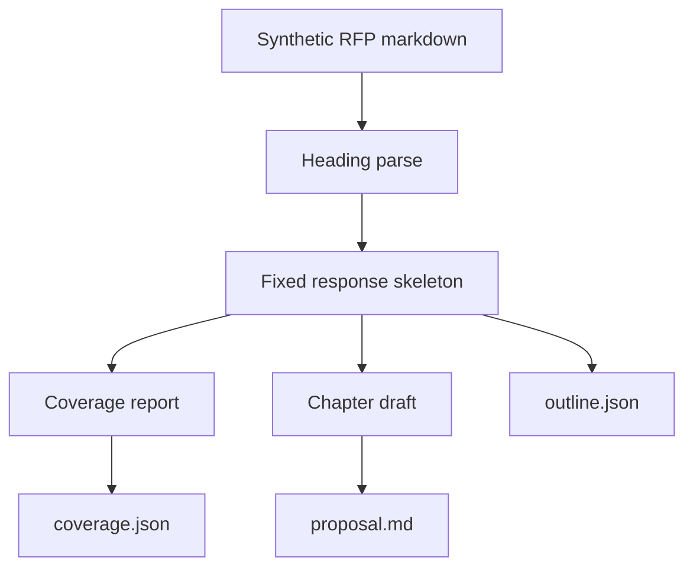

# Architecture

The public slice is a **document agent**, not a chat wrapper around a customer bid.

## Why this shape

A bidding agent has to answer the RFP it was given. Empty headings stay empty. Prompt text can explain tone; it must not invent a training plan that the pack never asked for.

| Layer | What the agent gets |
| --- | --- |
| Ingest | Markdown bid pack (PDF/DOCX later) |
| Outline | Stable section ids (`scope`, `functional`, …) |
| Coverage | `missing[]` — required ids with no RFP bullets |
| Draft | Traces each bullet; refuses to fill gaps |
| Export | `proposal.md` + `outline.json` + `coverage.json` |

## What this repo is not

- Not a dump of a live bid workbench
- Not a customer RFP or price envelope
- Not a Lark approval bot

## Interview line

*I built a document agent that turns an RFP into an outline, drafts only against that outline, and reports coverage gaps instead of inventing requirements.*
