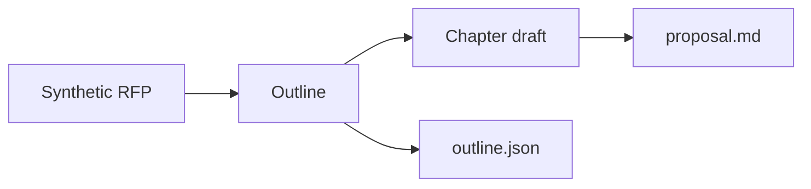

# Bidding Agent

An **RFP-to-proposal document agent**: ingest a bid pack, build a response outline, draft chapters, export markdown.

This is a **sanitized public slice**, not a dump of an internal bid workbench. The sample pack is a fictional regional DC. Customer RFPs, live prices, and internal hosts are stripped.

[](LICENSE)

## Workflow



| Step | What the agent does |
| --- | --- |
| Ingest | Read a markdown bid pack (later: PDF / DOCX) |
| Outline | Map RFP headings onto a fixed response skeleton |
| Draft | Trace each requirement; do not invent missing ones |
| Export | Write a technical proposal markdown **and** a JSON outline |

D1 runs **offline**. No API key. Swap the drafter for an OpenAI-compatible model later; the outline stays the contract.

## Quick start

```bash
python -m pip install pytest
python -m pytest
$env:PYTHONPATH="src"
python -m bidding_agent samples/rfp/harborlight-dc-rfp.md --out samples/output/proposal.md --outline samples/output/outline.json
```

On bash:

```bash
PYTHONPATH=src python -m bidding_agent samples/rfp/harborlight-dc-rfp.md --out samples/output/proposal.md --outline samples/output/outline.json
```

Open `samples/rfp/harborlight-dc-rfp.md` (the pack), `samples/output/proposal.md`, and `samples/output/outline.json`.

## What is in this snapshot

- English README and workflow diagram
- Synthetic Harborlight DC RFP
- Offline outline + chapter pipeline
- Secret scan (`scripts/scan-secrets.py`)

Not in this snapshot: customer bid files, Lark approval wiring, LLM keys.

Scan before every push:

```bash
python scripts/scan-secrets.py
```

GitHub About / topics: paste from [`GITHUB-ABOUT.md`](GITHUB-ABOUT.md). See [`SANITIZE.md`](SANITIZE.md).

## License

MIT
